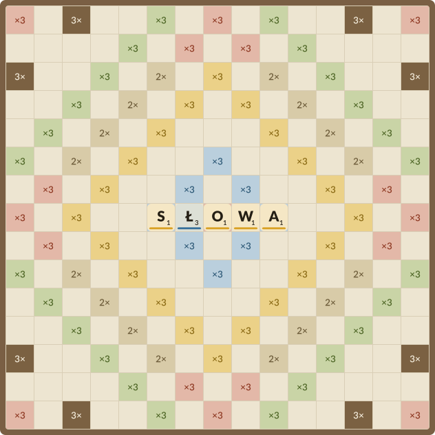

# Słowiki

A configurable Literaki/Scrabble-like word game for the web.



## Quickstart

Prerequisites: Python 3.12+, uv, Node.js 20+, npm.

```sh
make install
make build
make serve
```

Open <http://127.0.0.1:8532>, create a table, and share the six-letter join code.
`make build` prepares everything the server needs: the compiled SJP dictionary,
the typed API client, the generated icons and board specimens, and the frontend
bundle. A terminal game runs with `make play`.

The app installs as a PWA from the browser; `docs/mobile.md` records the
Capacitor steps for native iOS and Android shells.

## Configuration

YAML under `config/` is the single authoritative configuration source:

- `config/config.yaml` — service address, table lifetimes, active scheme, active
  style.
- `config/schemes/` — game presets (literaki, scrabble, solo-literaki). Each one
  states its name and a single `rules:` record: which board, alphabet,
  distribution and word list it plays with, how many seats and tiles a rack
  holds, and every rule a table may change.
- `config/presets/boards/` — board size and bonus squares.
- `config/presets/alphabets/` — the letters a game plays with, their order, what
  each class of letters is worth, and the word lists it suits.
- `config/presets/distributions/` — how many tiles of each letter the bag holds.
- `config/styles/` — the design tokens (light and dark) for the board, tiles,
  premiums, and chrome.

To add a variant, add a scheme file plus the board, alphabet, and distribution
files it names. An alphabet and a distribution pair freely, so Polish letters at
Scrabble values on the Literaki distribution is a scheme, not a new file.
The offerings endpoint lists a scheme once its dictionary archive is present in
`dictionaries/`; dropping `english.zip` there enables Scrabble.

The server reads the whole tree at startup and refuses to start on a fault, so a
scheme naming a board that is absent, an alphabet that leaves a letter unvalued,
or a word list its letters do not suit is reported before the first table opens.

## Deployment

Railway builds and serves the game from the `Dockerfile`: it downloads the SJP
dictionary archive, compiles the lexicon, generates the API client, strings,
and artwork, and builds the frontend bundle. The container runs the game server
on `0.0.0.0` and Railway's `$PORT`, serving the API and the frontend from one
origin. Create a Railway service from the repository; `railway.json` pins the
Dockerfile build and the `/offerings` health check.

## Development

`make check` runs the backend gates (pre-commit, mypy, pylint, import contracts,
pytest with coverage). The frontend gates live in `frontend/`: `npm run lint`,
`npm run typecheck`, `npm test`, and `npm run build`; pre-commit runs them for
changed frontend files, and the push hook runs the frontend tests. `make types`
regenerates the typed API client after backend contract changes, and
`make assets` regenerates icons, brand art, and board specimens from the style
tokens.
